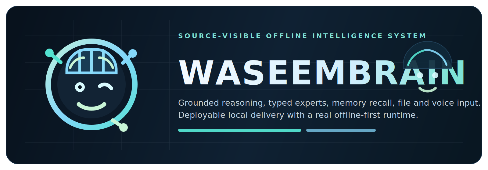

<p align="center">
  
</p>

<p align="center">
  <strong>Waseem Brain</strong><br />
  Assistant-first local intelligence runtime with grounded chat, hybrid agent power, protected automation, memory, repo work, and live voice-ready delivery.
</p>

<p align="center">
  Created, architected, and owned by <strong>MUHAMMAD WASEEM AKRAM</strong>.<br />
  📧 waseemjutt814@gmail.com | 📱 +923164290739 | 🐙 @waseemjutt814<br />
  Source-visible and restricted-use. This repository is not open source.
</p>

## Ownership And Usage Status
Waseem Brain is source-visible for inspection and private evaluation only. Permission to reuse, modify, redistribute, benchmark publicly, train on, commercialize, deploy as a service, or extract substantial parts of the codebase is not granted by default.

See [LICENSE.md](LICENSE.md) and [NOTICE.md](NOTICE.md).

## Product Direction
Waseem Brain is being rebuilt as one professional assistant product instead of a dashboard collection.

Current direction:
- local grounded mode is the explicit default and works without an API key or a required local LLM
- hybrid mode stays optional and additive: memory, repo search, web grounding, and protected automation remain local while an OpenAI-compatible backend upgrades answer quality when configured
- the main web surface is assistant-first: chat in the center, voice inline, proof on every meaningful answer, and actions/settings as secondary panels
- the terminal is being upgraded to the same assistant protocol with modes, searchable actions, proof, and runtime status
- dangerous automation never runs silently; preview plus confirmation is required

## Main Surfaces
- Web assistant console: `/chat.html`
- Structured assistant websocket: `GET /ws/assistant`
- Action catalog: `GET /api/actions`
- Runtime health: `GET /health`
- Compatibility routes: `/query/text`, `/query/url`, `/query/file`, `/query/voice`, and `/ws`

## Runtime Modes
- `local grounded`: no external model required; answers come from workspace evidence, built-in knowledge, memory, repo search, and available tools
- `hybrid`: same local grounding plus an OpenAI-compatible model for broader conversational and coding quality when configured
- `protected actions`: system reads execute immediately when safe; state-changing actions require preview and explicit confirmation

## Quick Start
```bash
pnpm install
pnpm run setup:python
pnpm run dev
```

`pnpm run dev` opens the launcher for interface, terminal, both, or backend only. Interface and terminal flows auto-start the backend daemon when needed.

Direct entrypoints:
```bash
pnpm run chat
pnpm run dev:interface
pnpm run dev:terminal
pnpm run dev:both
pnpm run runtime:start
```

## Docker Compose
```bash
docker compose up --build
```

Compose runs two real services:
- `brain-runtime`: the Python assistant runtime daemon on the internal Compose network
- `interface`: the Fastify assistant console on `8080`

Healthchecks are included for both services, shared `data/logs/tmp` directories persist on the host, and only the browser surface is published by default.

## Configuration
Use `.env.example` as the baseline. The assistant rebuild adds these important controls:
- `ASSISTANT_MODE=local|hybrid`
- `MODEL_PROVIDER=openai_compatible`
- `MODEL_BASE_URL`
- `MODEL_NAME`
- `MODEL_API_KEY`
- `VOICE_TTS_ENABLED=true|false`
- `ACTION_AUDIT_PATH`

## Verification
Fast gate:
```bash
pnpm test
```

That runs:
- lint
- placeholder guard
- TypeScript suite
- Python suite

Full report with counts, pass/fail, and project inventory:
```bash
pnpm run report:project
```

Industrial Docker smoke:
```bash
pnpm run docker:smoke
```

That report writes:
- `logs/project_report.json`
- `logs/project_report.md`

It includes:
- total file count
- top-level directory counts
- extension counts
- Python function, async-function, and class counts
- test file counts
- per-command pass/fail summaries
- runtime health snapshot

## 🤖 AGENT FRAMEWORKS - HIGH-PERFORMANCE IMPLEMENTATIONS

### � AGENT V1 - PYTHON EDITION (FOUNDATION)
```
╔══════════════════════════════════════════════════════════════════════════╗
║                                                                          ║
║   🐍  WASEEM AGENT V1 - PYTHON FOUNDATION  🐍                          ║
║                                                                          ║
║   Original intelligent agent with comprehensive capabilities             ║
║                                                                          ║
║   ✓ Code Generation         ✓ Code Execution                          ║
║   ✓ Quality Validation      ✓ Safety Protocols                          ║
║   ✓ Learning Engine         ✓ Voice Integration                        ║
║   ✓ Health Monitoring       ✓ Build Systems                            ║
║   ✓ Feedback Loop           ✓ Test Automation                         ║
║   ✓ Multi-Agent Runtime     ✓ Orchestration Engine                    ║
║                                                                          ║
║   Location: agents_and_runners/                                          ║
║   Stack: Python + Async + Industrial-Grade Components                   ║
║   Files: 20+ Professional Modules                                      ║
║                                                                          ║
╚══════════════════════════════════════════════════════════════════════════╝
```

**Key Capabilities:**
| Module | Function |
|--------|----------|
| `waseem_agent.py` | Core intelligent agent with reasoning |
| `waseem_orchestrator.py` | Multi-agent orchestration system |
| `code_generator.py` | Type-safe code synthesis |
| `code_executor.py` | Secure code execution environment |
| `quality_validator.py` | Industrial quality validation |
| `learning_engine.py` | Self-improving learning system |
| `safety_protocols.py` | Comprehensive safety framework |
| `voice_integration.py` | Voice command processing |
| `reasoning_engine.py` | Advanced reasoning capabilities |
| `runtime_bridge.py` | Multi-language runtime bridge |
| `health_check.py` | System health monitoring |
| `build_system.py` | Multi-platform build orchestration |

**Quick Start:**
```bash
cd agents_and_runners
python waseem_agent.py
# or
python waseem_complete_system.py
# or
python run_super_agent.py
```

---

### � AGENT V2 - OCAML EDITION
```
╔══════════════════════════════════════════════════════════════════════════╗
║                                                                          ║
║   🐫  REAL OCAML AGENT  🐫                                               ║
║                                                                          ║
║   Production-ready agent written in OCaml with Lwt async runtime         ║
║                                                                          ║
║   ✓ Real command execution    ✓ Real file I/O                         ║
║   ✓ Real git operations       ✓ HTTP requests                         ║
║   ✓ Context management        ✓ Message history                        ║
║                                                                          ║
║   Location: agent-v2/                                                    ║
║   Stack: OCaml + Lwt + Dune                                              ║
║                                                                          ║
╚══════════════════════════════════════════════════════════════════════════╝
```

**Quick Start:**
```bash
cd agent-v2
dune build
dune exec agent-v2
```

---

### 🦀 AGENT V3 - RUST EDITION
```
╔══════════════════════════════════════════════════════════════════════════╗
║                                                                          ║
║   🦀  PURE RUST PRODUCTION AGENT  🦀                                     ║
║                                                                          ║
║   TOP-TIER agent with 20 REAL implementations - ZERO MOCKS               ║
║                                                                          ║
║   ✓ File I/O (Real)         ✓ Command Execution (Real)                 ║
║   ✓ HTTP Requests (Real)    ✓ Git Operations (Real)                   ║
║   ✓ Web Scraping (Real)     ✓ Database Queries (Real)                  ║
║   ✓ Docker Operations       ✓ AWS S3 Integration                      ║
║   ✓ PDF Processing          ✓ Image OCR                               ║
║   ✓ Email SMTP              ✓ Webhook Notifications                     ║
║   ✓ AI/LLM Integration      ✓ Project Build Systems                     ║
║                                                                          ║
║   Location: agent-v3/                                                    ║
║   Stack: Rust + Tokio + 10 High-Value Skills                            ║
║                                                                          ║
╚══════════════════════════════════════════════════════════════════════════╝
```

**Quick Start:**
```bash
cd agent-v3
cargo build --release
cargo run
```

**10 High-Value Skills Included:**
1. `AiPrompt` - OpenAI/LLM integration
2. `DatabaseQuery` - SQL operations
3. `WebScrape` - Data extraction
4. `Docker` - Container management
5. `AwsS3` - Cloud storage
6. `PdfExtract` - PDF parsing
7. `ImageOcr` - Text from images
8. `SendEmail` - SMTP operations
9. `WebhookNotify` - Slack/Discord/Teams
10. `BuildProject` - Compile & test code

---

## Architecture
| Layer | Responsibility |
| --- | --- |
| `brain/` | assistant orchestration, coordinator logic, memory, routing, learning, provider integration, and health |
| `interface/` | Fastify server, assistant websocket, action/catalog routes, browser shell, and generated web assets |
| `experts/` | expert manifests, router artifact, response policy, and bootstrap knowledge |
| `scripts/` | daemon lifecycle, terminal client, build/report tooling, metadata sync, and safety guards |
| `tests/` | Python and TypeScript verification for runtime, routes, browser shell, assistant websocket, and quality gates |
| `agents_and_runners/` | **🐍 Agent V1** - Python foundation with 20+ professional modules |
| `agent-v2/` | **🐫 OCaml Agent** - Real async agent with Lwt |
| `agent-v3/` | **🦀 Rust Agent** - Production agent with 20 real actions + protection |
| `dist/` | deployable bundle output |

## Repository Landmarks
- `brain/runtime.py`: main assistant runtime and health surface
- `brain/assistant/`: assistant orchestration, provider abstraction, action registry, and event types
- `interface/src/server.ts`: interface bootstrap, gateway selection, and backend autostart logic
- `interface/src/ws/assistant.ts`: structured assistant session bridge for web chat, voice, and protected actions
- `interface/src/web/`: assistant-first web UI sources
- `scripts/chat_cli.py`: terminal assistant console
- `scripts/guard_no_placeholders.py`: no-fake-work safety gate
- `scripts/project_report.py`: one-command inventory and verification summary

## Living Roadmap
The industrial implementation roadmap and completion log live in docs/INDUSTRIAL_REBUILD_PLAN.md.

## Build And Dist
```bash
pnpm run build
```

That produces `dist/` with:
- compiled Fastify server code
- generated browser assets
- runtime public assets
- Python runtime source
- expert registry and bootstrap knowledge
- runtime bridge/daemon scripts
- Python wheel and runtime dependency snapshot
- copied license and ownership files

## Protection Model
Readable source cannot be meaningfully DRM-protected once it is shared in Git form. The practical protection applied in this repository is intentional and honest:
- a source-visible restricted-use license in `LICENSE.md`
- explicit author and ownership notice in `NOTICE.md`
- `package.json` remains `private` to reduce accidental registry publication
- build artifacts inherit the same licensing and ownership metadata

## Author And Stewardship
Waseem Brain was created and is actively developed by **Muhammad Waseem Akram**.

Product direction, architecture, implementation, branding, and licensing authority remain with the author. If someone wants reuse, deployment, derivative rights, or commercial access, that permission should come from the author in writing.
